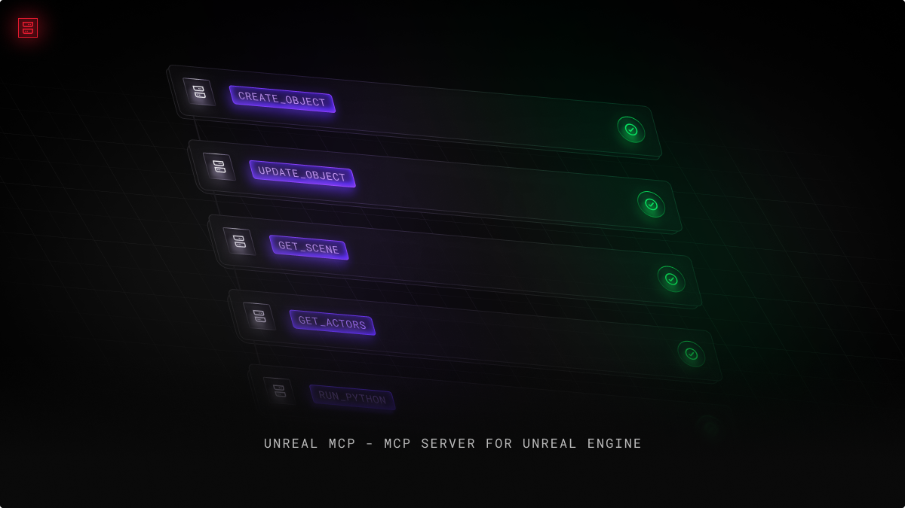
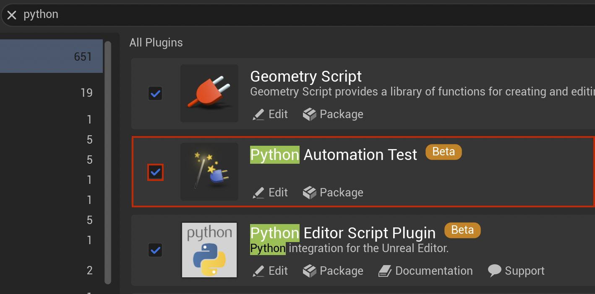
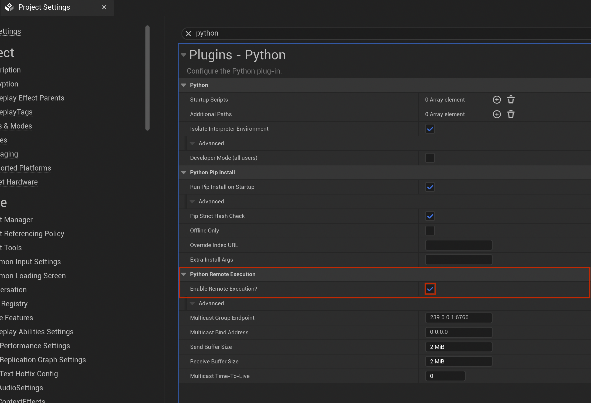

# unreal-mcp-ue4
> UE4.27.2-focused MCP server for Unreal Engine that uses Unreal Python Remote Execution

Based on the original project: [runreal/unreal-mcp](https://github.com/runreal/unreal-mcp)

This fork was modified to support Unreal Engine 4.27 while preserving the original Unreal MCP workflow where possible.

This UE4.27 port and the follow-up tool, documentation, and smoke-test extensions were developed with assistance from OpenAI Codex.




[](https://github.com/conaman/unreal-mcp-ue4/blob/main/LICENSE)

## ⚡ Differences

This server does not require installing a new UE plugin as it uses the built-in Python remote execution protocol.

Adding new tools/features is much faster to develop since it does not require any C++ code.

This fork adds UE4.27.2 compatibility while keeping equivalent UE5 editor scripting paths where they overlap.

Original source: [runreal/unreal-mcp](https://github.com/runreal/unreal-mcp)

It can support the [Unreal Engine Python API for 4.27](https://dev.epicgames.com/documentation/en-us/unreal-engine/python-api/?application_version=4.27)


## ⚠️ Note

- This is not an official Unreal Engine project.
- Your AI agents or tools will have full access to your Editor.
- Review any changes your Client suggests before you approve them.

## 📦 Installation

#### 📋 Requirements
- 🔧 Unreal Engine 4.27.2 (verified)
- 🟢 Node.js 18+ (`npm` is included with Node.js. You do not need `rpm` on Windows.)
- 🟢 npm (recommended) or pnpm
- 🤖 MCP Client (Claude, Cursor, etc.)

1. Setting up your Editor:
   - Open your Unreal Engine project
   - Go to `Edit` -> `Plugins`
   - Search for "Python Editor Script Plugin" and enable it
   - Search for "Editor Scripting Utilities" and enable it
   - Restart the editor if prompted
   - Go to `Edit` -> `Project Settings` 
   - Search for "Python" and enable the "Enable Remote Execution" option

  
  

2. Set up your Client:
   - Build this local fork
```bash
npm install
npm run build

# or
pnpm install
pnpm build
```
   - Edit your Claude (or Cursor) config
```json
{
  "mcpServers": {
    "unreal-ue4": {
      "command": "node",
      "args": [
        "/absolute/path/to/runreal_unreal_mcp_ue4/dist/bin.js"
      ]
    }
  }
}
```

### ✅ End-to-End Smoke Test

With your UE4.27.2 project open and Remote Execution enabled, you can run a deterministic MCP smoke test directly against the local server:

```bash
cd /Users/conaman/Works/runreal_unreal_mcp_ue4
npm run test:e2e
```

The default smoke test checks:
- MCP server startup and tool discovery
- project info, map info, and world outliner reads
- actor spawn, search, transform, inspect, and delete
- domain-tool dispatch for actor control

To also test Blueprint and UMG asset creation, run:

```bash
npm run test:e2e -- --with-assets
```

The asset-enabled run creates temporary Blueprint and Widget Blueprint assets under `/Game/MCP/Tests` and then attempts to clean them up automatically before exiting.

### 🪟 Windows Quick Start

Open PowerShell in the repository folder and run:

```powershell
cd C:\dev\unreal-mcp-ue4
npm install
npm run build
```

For Windows MCP client configs, use `node` if it is on your `PATH`:

```json
{
  "mcpServers": {
    "unreal-ue4": {
      "command": "node",
      "args": [
        "C:\\Users\\YourName\\dev\\unreal-mcp-ue4\\dist\\bin.js"
      ]
    }
  }
}
```

If your client cannot find `node`, point directly to `node.exe`:

```json
{
  "mcpServers": {
    "unreal-ue4": {
      "command": "C:\\Program Files\\nodejs\\node.exe",
      "args": [
        "C:\\Users\\YourName\\dev\\unreal-mcp-ue4\\dist\\bin.js"
      ]
    }
  }
}
```

### 🧰 GitHub Copilot

GitHub Copilot supports MCP in VS Code, Visual Studio, JetBrains, Eclipse, Xcode, and Copilot CLI. For a local `stdio` server like this project, VS Code is the simplest setup.

1. Build the server first:

```bash
npm install
npm run build
```

2. In VS Code, create `.vscode/mcp.json` in your workspace:

```json
{
  "servers": {
    "unreal-ue4": {
      "command": "node",
      "args": [
        "C:\\Users\\YourName\\dev\\unreal-mcp-ue4\\dist\\bin.js"
      ]
    }
  }
}
```

3. Open `.vscode/mcp.json` and click `Start`.
4. Open Copilot Chat and switch to `Agent` mode.
5. Open the tools picker and confirm that `unreal-ue4` is available.

If `node` is not on your `PATH`, use `C:\\Program Files\\nodejs\\node.exe` as the `command` value instead.

If you use Copilot Business or Copilot Enterprise, your organization may need to enable the `MCP servers in Copilot` policy first.

Official setup docs:
- [GitHub Docs: Extending GitHub Copilot Chat with MCP servers](https://docs.github.com/en/copilot/how-tos/provide-context/use-mcp/extend-copilot-chat-with-mcp)
- [GitHub Docs: About Model Context Protocol in GitHub Copilot](https://docs.github.com/en/copilot/concepts/context/mcp)

### 🔧 Troubleshooting

If you get an error similar to `MCP Unreal: Unexpected token 'C', Connection...` it means that the mcp-server was not able to connect to the Unreal Editor.

- Make sure that the Python Editor Script Plugin is enabled and that the Remote Execution option is checked in your project settings.
- Make sure that the Editor Scripting Utilities plugin is also enabled for UE4.27.2.
- On Windows, allow `UnrealEditor.exe` and `node.exe` through Windows Defender Firewall if node discovery fails. The bundled `unreal-remote-execution` package uses UDP multicast discovery on `239.0.0.1:6766` and a localhost command channel on `127.0.0.1:6776`.
- In Windows JSON config files, either escape backslashes (`C:\\path\\to\\dist\\bin.js`) or use forward slashes (`C:/path/to/dist/bin.js`).
- Try also changing your bind address from `127.0.0.1` to `0.0.0.0` but note that this will allow connections from your local network.
- Restart your Unreal Editor fully.
- Fully close/open your client (Claude, Cursor, etc.) to ensure it reconnects to the MCP server. (`File -> Exit` on windows).
- Check your running processes and kill any zombie unreal-mcp Node.js processes.

### 🧩 UMG Notes

- The UMG tools work against Widget Blueprint assets such as `/Game/UI/WBP_MainMenu`.
- The nested-widget commands use the UMG term `child widget` instead of `component`.
- Position changes currently target `CanvasPanel` slots in UE4.27. Non-canvas panel layouts are not repositioned by these tools.
- Creating nested `UserWidget` blueprint instances is not included in this UE4.27 port. Use native UMG widget classes such as `CanvasPanel`, `Border`, `Button`, `TextBlock`, and `Image`.
- Reparenting the current root widget and editing named-slot content are not handled by the current UMG commands.

### 🧪 Blueprint Notes

- The tool surface is grouped into Actor / Level, Physics & Materials, Blueprint Analysis, Blueprint Asset / Component, Blueprint Node Graph, Blueprint Graph Editing, Project / Input, World Building, Epic Structures, Level Design, and UMG categories.
- The World Building, Epic Structures, and Level Design tools are UE4.27-friendly preset builders that assemble scenes from engine basic-shape assets rather than importing any UE5-only generation systems.
- Several Blueprint graph and UMG binding commands rely on editor-only Python APIs that are only partially exposed in UE4.27. When Unreal does not expose a required editor type, the tool returns a clear unsupported message instead of failing silently.

### 🧭 Domain Tool Notes

- This port also exposes domain tools that use an `action` plus `params` dispatch shape on top of the granular UE4.27 tool set.
- Domain tools reuse the existing UE4.27-safe editor scripting commands wherever possible instead of introducing a separate native C++ bridge layer.
- Actions that depend on systems not covered by this UE4.27 Python port return a clear unsupported response instead of pretending to implement the original UE5/C++ feature set.

## 🛠️ Available Tools

### Connection & Setup

| Tool | Description |
|------|-------------|
| `set_unreal_engine_path` | Set the Unreal Engine path |
| `set_unreal_project_path` | Set the Project path |
| `get_unreal_engine_path` | Get the current Unreal Engine path |
| `get_unreal_project_path` | Get the current Unreal Project path |

### Editor & Asset Tools

| Tool | Description |
|------|-------------|
| `editor_run_python` | Execute any python within the Unreal Editor |
| `editor_list_assets` | List all Unreal assets |
| `editor_export_asset` | Export an Unreal asset to text |
| `editor_get_asset_info` | Get information about an asset, including LOD levels for StaticMesh and SkeletalMesh assets |
| `editor_get_asset_references` | Get references for an asset |
| `editor_console_command` | Run a console command in Unreal |
| `editor_project_info` | Get detailed information about the current project |
| `editor_get_map_info` | Get detailed information about the current map/level |
| `editor_search_assets` | Search for assets by name or path with optional class filter |
| `editor_get_world_outliner` | Get all actors in the current world with their properties |
| `editor_validate_assets` | Validate assets in the project to check for errors |

### Actor / Level Tools

| Tool | Description |
|------|-------------|
| `editor_create_object` | Create a new object/actor in the world |
| `editor_update_object` | Update an existing object/actor in the world |
| `editor_delete_object` | Delete an object/actor from the world |
| `editor_take_screenshot` | Take a screenshot of the Unreal Editor |
| `editor_move_camera` | Move the viewport camera to a specific location and rotation for positioning screenshots |
| `get_actors_in_level` | Get all actors currently loaded in the editor level. |
| `find_actors_by_name` | Find level actors by matching a name or label pattern. |
| `spawn_actor` | Spawn a native actor class into the current level. |
| `delete_actor` | Delete a level actor by name or actor label. |
| `set_actor_transform` | Set actor location, rotation, or scale in the current level. |
| `get_actor_properties` | Inspect common editor properties for a specific actor. |
| `get_actor_material_info` | Inspect the material slots used by an actor |
| `set_actor_property` | Set a single editor property on an existing actor. |
| `spawn_blueprint_actor` | Spawn an actor from a Blueprint asset into the current level. |

### Physics & Materials Tools

| Tool | Description |
|------|-------------|
| `spawn_physics_blueprint_actor` | Spawn a Blueprint actor and enable physics on a material-capable component. |
| `get_available_materials` | List project or engine materials available for assignment. |
| `apply_material_to_actor` | Apply a material asset to an actor |
| `apply_material_to_blueprint` | Apply a material asset to a Blueprint component template. |
| `set_mesh_material_color` | Tint a mesh material by editing or generating a material instance constant. |

### Blueprint Analysis Tools

| Tool | Description |
|------|-------------|
| `read_blueprint_content` | Read a Blueprint |
| `analyze_blueprint_graph` | Analyze Blueprint graph nodes and connections. |
| `get_blueprint_variable_details` | Inspect Blueprint variable definitions and pin metadata. |
| `get_blueprint_function_details` | Inspect Blueprint function graphs, entry nodes, and call nodes. |

### Blueprint Asset / Component Tools

| Tool | Description |
|------|-------------|
| `create_blueprint` | Create a new Blueprint asset from a parent class. |
| `add_component_to_blueprint` | Add a component to a Blueprint construction script. |
| `set_static_mesh_properties` | Assign a Static Mesh asset to a Blueprint StaticMeshComponent. |
| `set_component_property` | Set a single editor property on a Blueprint component template. |
| `set_physics_properties` | Apply common physics settings to a Blueprint component template. |
| `compile_blueprint` | Compile and save a Blueprint asset after edits. |
| `set_blueprint_property` | Set a class default property on a Blueprint asset. |

### Blueprint Node Graph Tools

| Tool | Description |
|------|-------------|
| `add_blueprint_event_node` | Add an event node to a Blueprint event graph. |
| `add_blueprint_input_action_node` | Add an input action event node to a Blueprint event graph. |
| `add_blueprint_function_node` | Add a function call node to a Blueprint graph. |
| `connect_blueprint_nodes` | Connect two Blueprint graph pins by node id and pin name. |
| `add_blueprint_variable` | Add a variable declaration to a Blueprint asset. |
| `add_blueprint_get_self_component_reference` | Add a Blueprint node that gets a component reference from self. |
| `add_blueprint_self_reference` | Add a self reference node to a Blueprint graph. |
| `find_blueprint_nodes` | Search Blueprint graphs for matching node titles, names, or classes. |

### Blueprint Graph Editing Tools

| Tool | Description |
|------|-------------|
| `add_node` | Add a low-level Blueprint graph node using a helper node_type or raw node_class. |
| `connect_nodes` | Connect low-level Blueprint graph pins by node id and pin name. |
| `disconnect_nodes` | Disconnect low-level Blueprint graph links for a pin or a specific pin-to-pin connection. |
| `create_variable` | Create a low-level Blueprint variable declaration. |

### Project / Input Tools

| Tool | Description |
|------|-------------|
| `create_input_mapping` | Create an Action or Axis mapping in DefaultInput.ini for the current project. |

### World Building Tools

| Tool | Description |
|------|-------------|
| `create_town` | Create a procedural small town using UE basic shapes. |
| `construct_house` | Construct a house preset from UE basic shapes. |
| `construct_mansion` | Construct a mansion preset from UE basic shapes. |
| `create_tower` | Create a tower preset from UE basic shapes. |
| `create_arch` | Create an arch preset from UE basic shapes. |
| `create_staircase` | Create a staircase preset from UE basic shapes. |

### Epic Structures Tools

| Tool | Description |
|------|-------------|
| `create_castle_fortress` | Create a castle fortress preset from UE basic shapes. |
| `create_suspension_bridge` | Create a suspension bridge preset from UE basic shapes. |
| `create_bridge` | Create a simple bridge preset from UE basic shapes. |
| `create_aqueduct` | Create an aqueduct preset from UE basic shapes. |

### Level Design Tools

| Tool | Description |
|------|-------------|
| `create_maze` | Create a procedural maze from UE basic shapes. |
| `create_pyramid` | Create a stepped pyramid from UE basic shapes. |
| `create_wall` | Create a reusable wall segment preset from UE basic shapes. |

### UMG Tools

| Tool | Description |
|------|-------------|
| `editor_umg_add_widget` | Add a UMG widget to a Widget Blueprint |
| `editor_umg_remove_widget` | Remove a UMG widget from a Widget Blueprint by widget name |
| `editor_umg_set_widget_position` | Set the position of a UMG widget inside a Widget Blueprint |
| `editor_umg_reparent_widget` | Change the parent panel of an existing UMG widget inside a Widget Blueprint |
| `editor_umg_add_child_widget` | Add a child widget to a parent panel inside a Widget Blueprint |
| `editor_umg_remove_child_widget` | Remove a direct child widget from a parent panel inside a Widget Blueprint. |
| `editor_umg_set_child_widget_position` | Set the position of a direct child widget on a parent panel inside a Widget Blueprint |
| `create_umg_widget_blueprint` | Create a Widget Blueprint asset for UMG authoring. |
| `add_text_block_to_widget` | Add a TextBlock to a Widget Blueprint and optionally position it on a CanvasPanel. |
| `add_button_to_widget` | Add a Button to a Widget Blueprint and optionally place it on a CanvasPanel. |
| `bind_widget_event` | Bind a widget event to a Blueprint function when delegate editing is exposed by UE4.27 Python. |
| `add_widget_to_viewport` | Instantiate a Widget Blueprint and add it to the active PIE or game viewport. |
| `set_text_block_binding` | Configure a TextBlock binding when delegate editing is exposed by UE4.27 Python. |

### Domain Tools

| Tool | Description |
|------|-------------|
| `manage_asset` | Domain asset namespace for list, search, info, references, export, and validation actions. |
| `control_actor` | Domain actor namespace for listing, searching, spawning, deleting, transforming, and inspecting level actors. |
| `control_editor` | Domain editor namespace for Python execution, console commands, project inspection, map inspection, screenshots, and camera control. |
| `manage_level` | Domain level namespace for map inspection, actor listing, world outliner inspection, and preset structure creation actions. |
| `system_control` | Domain system namespace for console commands, project state inspection, and asset validation actions. |
| `inspect` | Domain inspection namespace for asset, actor, project, map, and Blueprint analysis actions. |
| `manage_pipeline` | Domain pipeline namespace for asset validation, project inspection, and tool status reporting actions. |
| `manage_tools` | Domain tool-management namespace for listing registered domain tools and describing supported actions. |
| `manage_lighting` | Domain lighting namespace for spawning common light actors, transforming them, and inspecting level lighting state. |
| `manage_level_structure` | Domain level-structure namespace for preset town, house, mansion, tower, wall, bridge, and fortress construction actions. |
| `manage_volumes` | Domain volume namespace for spawning common engine volumes and applying delete or transform actions. |
| `manage_navigation` | Domain navigation namespace for spawning navigation volumes and proxies plus basic map inspection actions. |
| `build_environment` | Domain environment-building namespace for preset town, arch, staircase, pyramid, and maze generation actions. |
| `manage_splines` | Domain spline namespace for spawning a spline-host actor or Blueprint and then transforming or deleting it. |
| `animation_physics` | Domain animation-and-physics namespace for physics Blueprint spawning, Blueprint physics settings, and Blueprint compilation actions. |
| `manage_skeleton` | Domain skeleton namespace for searching Skeleton and SkeletalMesh assets and inspecting their metadata. |
| `manage_geometry` | Domain geometry namespace for wall, arch, staircase, and pyramid preset construction actions. |
| `manage_effect` | Domain effects namespace for spawning debug-shape actors, assigning materials, tinting them, and deleting them. |
| `manage_material_authoring` | Domain material namespace for listing materials, applying them to actors or Blueprints, and tinting them with material instances. |
| `manage_texture` | Domain texture namespace for searching texture assets and reading their asset metadata. |
| `manage_blueprint` | Domain Blueprint namespace for Blueprint creation, component editing, graph editing, compilation, and Blueprint inspection actions. |
| `manage_sequence` | Domain sequence namespace for searching LevelSequence assets and inspecting their asset metadata. |
| `manage_performance` | Domain performance namespace for editor console commands and screenshot capture actions. |
| `manage_audio` | Domain audio namespace for searching audio assets and inspecting their asset metadata. |
| `manage_input` | Domain input namespace for creating classic UE4 input mappings and inspecting project input settings. |
| `manage_behavior_tree` | Domain behavior-tree namespace for searching BehaviorTree assets and inspecting their asset metadata. |
| `manage_ai` | Domain AI namespace for searching AI-related assets through the existing asset registry and project inspection actions. |
| `manage_gas` | Domain GAS namespace for searching gameplay-ability-related assets and inspecting their asset metadata. |
| `manage_character` | Domain character namespace for creating Blueprint characters, spawning Blueprint actors, and inspecting project character data. |
| `manage_combat` | Domain combat namespace for combat Blueprint scaffolding, Blueprint actor spawning, and actor property edits. |
| `manage_inventory` | Domain inventory namespace for Blueprint scaffolding, Blueprint default-property edits, and Blueprint compilation actions. |
| `manage_interaction` | Domain interaction namespace for Blueprint scaffolding, component wiring, and Blueprint actor spawning actions. |
| `manage_widget_authoring` | Domain widget namespace for UMG Blueprint creation, widget-tree edits, viewport spawning, and basic binding actions. |
| `manage_networking` | Domain networking namespace for project inspection and console-command driven networking diagnostics. |
| `manage_game_framework` | Domain game-framework namespace for project inspection and gameplay Blueprint scaffolding actions. |
| `manage_sessions` | Domain sessions namespace for project inspection and console-command driven local session diagnostics. |

## 🤝 Contributing

Please feel free to open issues or pull requests. Contributions are welcome, especially new tools/commands.

## 📄 License

Licensed under the [MIT License](LICENSE).
